# Stress Testing Spring Boot Application

# Project structure
- app: backend application
- mongodb, mysql - databases application connects to
- prometheus - gathers app metrics
- grafana: dashboards for monitoring
- gradle: build tool for the app
- docs: performance tests results
- [docker compose](./docker-compose.yml)
- [env variables](./configuration.env)
- [dockerfile for the app](./Dockerfile)

# Prerequisites
- java (17.0.4-oracle)
- [Docker](https://www.docker.com/)
- [Docker compose](https://docs.docker.com/compose/)
- [Siege tool](https://www.joedog.org/siege-manual/#)

# Run stress tests
- run 
```shell
./gradlew clean build
```
- run ```docker-compose up --build -d```
- run siege script
```shell
siege --file=./siege/urls.txt --time=60S --delay=1 --concurrent=10 --internet --reps=10 --content-type "application/json"
```
- navigate to `localhost:3000` to watch prometheus dashboard in grafana for application metrics

# Performance Tests

## Test cases
- POST payload and save to MongoDB and MySQL
- get all entries from MongoDB
- get all entries from MySQL

## Parameters

Parameter| Test 1 | Test 2 | Test 3 |Test 4
--- |--------|--------|--------| ---
Concurrency| 10     | 25     | 50     |100
Delay| 1      | 1      | 1      |1
Time, sec| 60     | 60      | 60      |60
Reps| 10     | 10      | 10      |10

## Results
Metrics | Concurrency 10 | Concurrency 25 | Concurrency 50 | Concurrency 100 | Explanation 
--- |----------------|----------------|---------------|-----------------| ---
Transactions, **hits** | 1140           | 2957           | 5670          | 4800            | c100 processed less transactions due to higher response time. During the last test, the number of entries added to DB was too high to quickly transfer data back to the client. I also noticed that during the last test there were garbage collection of old generation that caused Stop the world. Also, number of connections during c100 test reached app's limit, therefore some client's/db threads were waiting to get connection
Availability, **%** | 100            | 100            | 100           | 100             |
Elapsed time, **secs** | 60.42          | 60.98          | 60.39         | 60.52           |
Data transferred, **MB** | 58.95          | 409.85         | 1833.78       | 2640.95         | During c50 and c100 more data was added to DB, therefore this mettric increased
Response time, **secs** | 0.01           | 0.02           | 0.03          | 0.76            | During c100 there was GC that caused stoping the app for a while. Also, because data saved to db increased, response time also increased
Transaction rate, **trans/sec** | 18.87          | 48.49          | 93.89         | 79.31           | More data size saved to db, occured GC, connection limit caused less transaction rate for the last c100 test
Throughput, **bytes** | 0.98           | 6.72           | 30.37         | 43.64           | Comparing transaction rate and throughput for c50 and c100, c100 has higher value because more data was transferred during each request
Concurrency | 0.23           | 0.82           | 2.83          | 60.35           | Depends on concurrency attribute
Successful transactions | 1140           | 2957           | 5670          | 4800            |
Failed transactions | 0              | 0              | 0             | 0               |
Longest transaction | 0.16           | 0.50           | 0.77          | 3.77            | Because of GC during c100 test, the longest transaction took much more time
Shortest transaction | 0.00           | 0.00           | 0.00          | 0.00            |

## Additional Grafana Dashboards

```shell
siege --file=./siege/urls.txt --time=60S --delay=1 --concurrent=10 --internet --reps=10 --content-type "application/json"
```

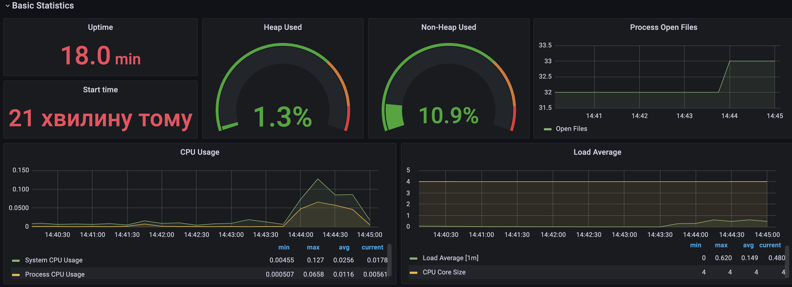
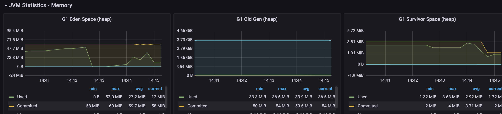
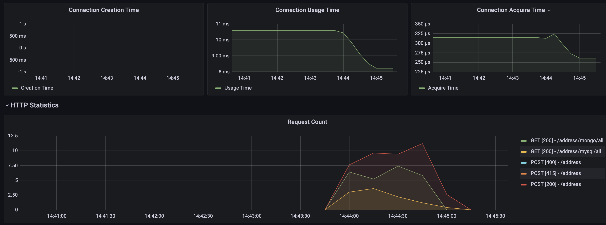

```shell
siege --file=./siege/urls.txt --time=60S --delay=1 --concurrent=25 --internet --reps=10 --content-type "application/json"
```

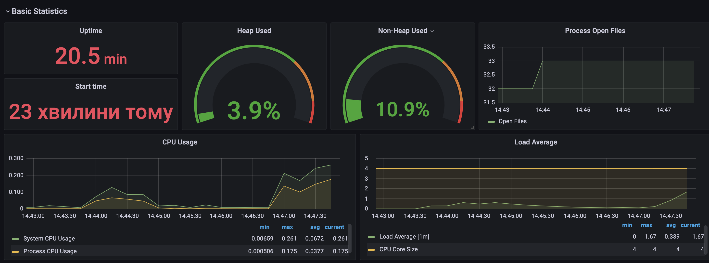
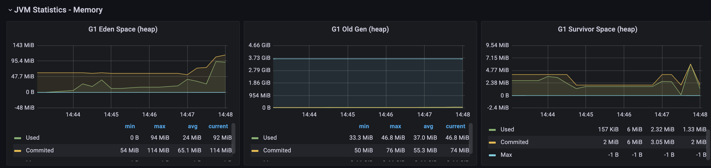
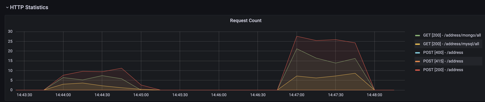

```shell
siege --file=./siege/urls.txt --time=60S --delay=1 --concurrent=50 --internet --reps=10 --content-type "application/json"
```

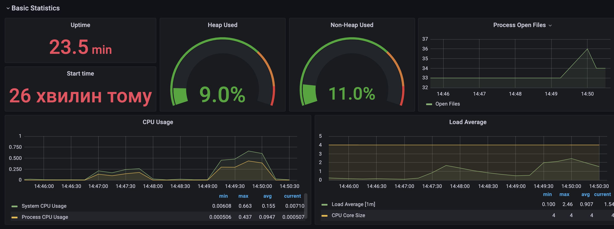
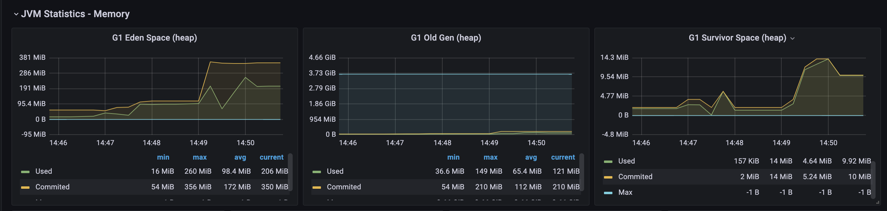
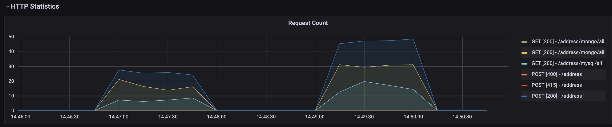

```shell
siege --file=./siege/urls.txt --time=60S --delay=1 --concurrent=100 --internet --reps=10 --content-type "application/json"
```

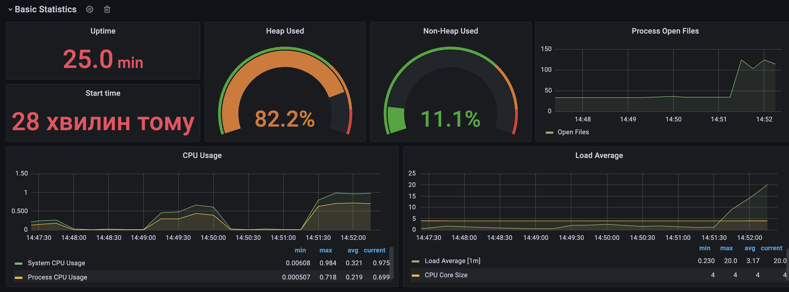
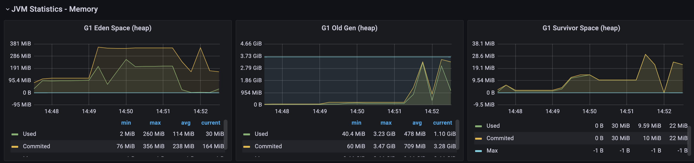
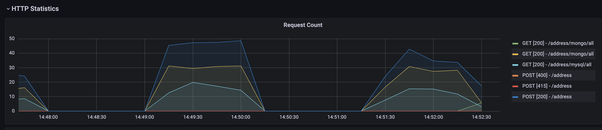


